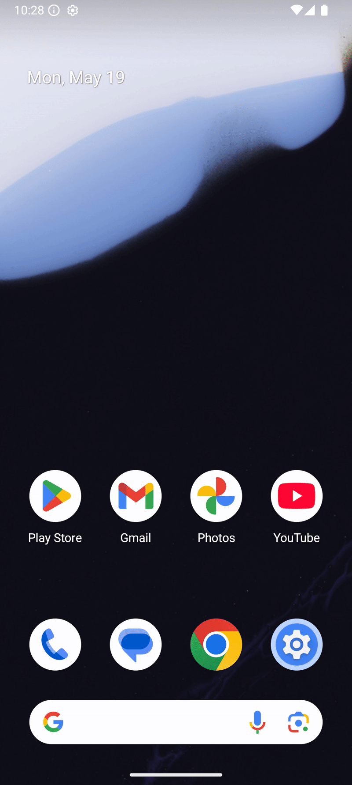
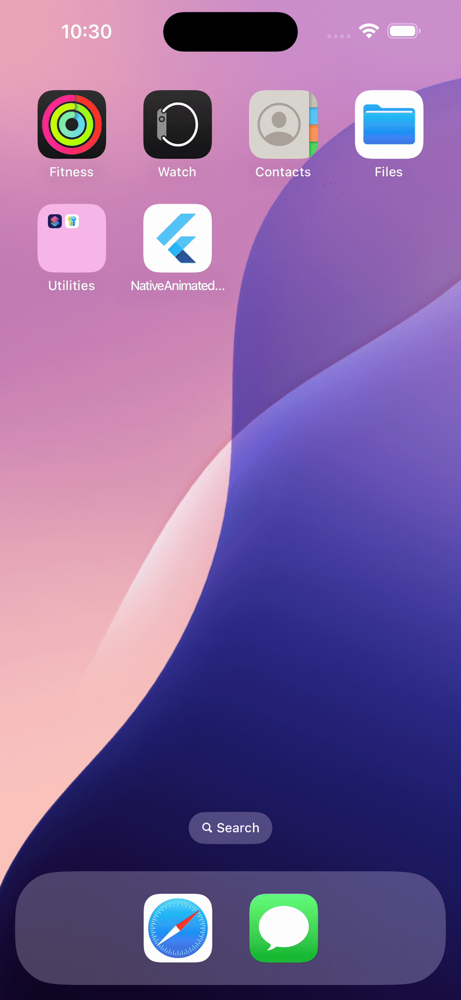
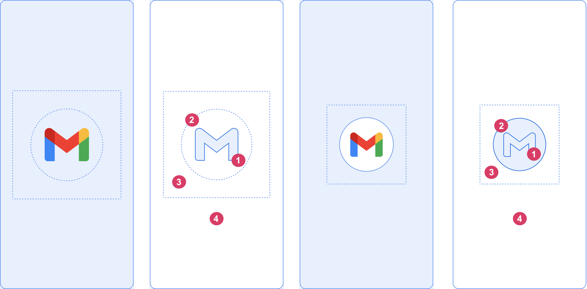

# Native Animated Splash

A Dart package for generating animated splash screens for Android and iOS platforms in Flutter projects. This tool automates the creation of platform-specific splash screen assets and configurations based on a YAML configuration file.

## Features

- Generates Android splash screen assets (images, animations, XML configurations)
- Creates iOS splash screen assets (image sets, storyboard)
- Supports customizable background colors, icons, branding images, and animations
- Updates platform-specific configuration files (e.g., AndroidManifest.xml, colors.xml, LaunchScreen.storyboard)
- Handles light and dark themes for Android

<p align="center">
  
  
</p>

## Prerequisites

- Dart SDK (version 3.0.0 or higher)
- Flutter (version 3.0.0 or higher)

## Installation

Add the package to your Flutter project's `pubspec.yaml`:

```yaml
dependencies:
  native_animated_splash: ^1.0.0
```

Install the dependencies by running:

```bash
flutter pub get
```

## Usage

Run the splash screen generator using the following command, specifying the path to your YAML configuration file:

```bash
dart run native_animated_splash:create --config path/to/splash_config.yaml
```

The tool will:
- Parse the configuration file
- Generate Android assets in `android/app/src/main/res`
- Generate iOS assets in `ios/Runner/Assets.xcassets` and `ios/Runner/Base.lproj`
- Print progress and error messages (in debug mode)

## Configuration File

Add thi structure to pubspec.yaml file with your desired values 

```yaml
flutter_animated_splash:
  color: "#FFFFFF"
  image: "assets/splash_image.png"
  splash_icon_background: "#FFFFFF"
  branding_image: "assets/branding.png"
  animation:
    android: "assets/splash_animation.xml"
    ios: "assets/animation.json"
```

### Configuration Fields

- `color`: The splash screen background color (hex, e.g., `#FFFFFF`). Default: `#FFFFFF`.
- `splash_icon_background`: The background color for the splash icon (hex). Default: `#FFFFFF`.
- `image`: Path to the main splash image (PNG recommended, required).
- `branding_image`: Path to an optional branding image (e.g., a logo at the bottom, PNG recommended).
- `animation.android`: Path to an optional Android animation file (XML).
- `animation.ios`: Path to an optional iOS animation file (e.g., JSON or GIF).

Ensure all file paths are valid and accessible relative to the project directory (e.g., in the `assets/` folder).

## Project Structure

The tool expects a standard Flutter project structure:

```
project/
├── android/
│   └── app/src/main/
├── ios/
│   └── Runner/
│       ├── Assets.xcassets/
│       └── Base.lproj/
├── assets/
│   ├── splash_image.png
│   ├── branding.png
│   ├── splash_animation.xml
│   └── animation.json
├── splash_config.yaml
└── pubspec.yaml
```

Ensure your `pubspec.yaml` includes the assets:

```yaml
flutter:
  assets:
    - assets/splash_image.png
    - assets/branding.png
    - assets/splash_animation.xml
    - assets/animation.json
```

## Android 12+ Support

Android 12 introduced a new splash screen API that uses a window background, icon, and icon background. **Note**: Background images are not supported in this API.




### Considerations

- **Image Parameter**:
    - By default, the app's launcher icon is used.
    - **Without an icon background**: The image should be 1152×1152 pixels and fit within a circle 768 pixels in diameter.
    - **With an icon background**: The image should be 960×960 pixels and fit within a circle 640 pixels in diameter.
- **Icon Background Color** (`splash_icon_background`):
    - Optional, used to provide contrast between the icon and the window background.
- **Foreground Masking**:
    - One-third of the icon's foreground is masked by the system.
- **Window Background Color** (`color`):
    - Consists of a single opaque color specified in the YAML configuration.

### Known Issues

- **Android Studio on API 31**:
    - The splash screen may not appear when launching the app from Android Studio on API 31. However, it should display correctly when launching via the app's icon on the device. This issue appears to be resolved in API 32+.
- **Non-Google Launchers**:
    - Some non-Google launchers may not display the splash screen correctly. If issues occur, test with the Google launcher to confirm the package is functioning as expected.
- **Notifications**:
    - The splash screen does not appear when the app is launched from a notification on Android 12, as per the core splash screen behavior.

## Contributing

Contributions are welcome! To contribute:

1. Fork the repository.
2. Create a feature branch (`git checkout -b feature/your-feature`).
3. Commit your changes (`git commit -m "Add your feature"`).
4. Push to the branch (`git push origin feature/your-feature`).
5. Open a pull request.

Please include tests and update documentation for new features.

## License

This project is licensed under the MIT License. See the [LICENSE](LICENSE) file for details.

## Acknowledgments

- Built with Dart and Flutter.
- Inspired by the need for automated, animated splash screen generation in cross-platform apps.